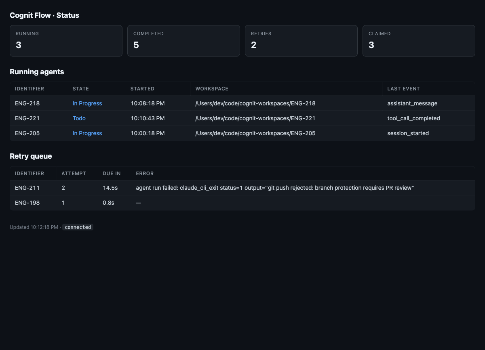

# Cognit Flow

> Self-hosted orchestration service that turns a [Linear](https://linear.app/) backlog into autonomous coding-agent runs — drives [Claude Code](https://docs.claude.com/en/docs/claude-code/overview) and [OpenAI Codex CLI](https://github.com/openai/codex) in isolated per-issue workspaces, with a real-time HTTP dashboard for live observability. **Built in TypeScript on Node.js**.

[](https://github.com/gxPan1006/cognit-flow/actions/workflows/ci.yml)
[](LICENSE)
[](https://nodejs.org/)
[](https://www.typescriptlang.org/)

> ⚠️ **Not affiliated with Cognition AI (Devin).** This project is a community-built coding-agent orchestrator. The name shares a Latin root, nothing more. If you came here looking for Devin, this is **not** that — Cognit Flow is a thin scheduler/observability layer that you point at *your own* model API key via Claude Code or Codex CLI.

> 💡 **Sibling project:** Cognit Flow is the TypeScript implementation. The original Elixir/Phoenix version of the same orchestrator lives at [`gxPan1006/cognition-orchestrator`](https://github.com/gxPan1006/cognition-orchestrator) — same `WORKFLOW.md` contract, same Linear / Claude Code / Codex integrations. Pick whichever runtime fits your stack.



---

## What is it?

Cognit Flow is a long-running daemon that:

- **Polls Linear** on a fixed cadence for tickets that match your active-state filter.
- **Provisions an isolated workspace per issue** (git checkout, dedicated runtime dir) — one bad agent run can't poison another.
- **Launches an autonomous coding agent** inside that workspace — **OpenAI Codex CLI** or **Anthropic Claude Code CLI** — with a per-repo `WORKFLOW.md` prompt that you version-control.
- **Keeps the agent working** on the ticket until the issue leaves an active state, with bounded retries and exponential backoff.
- **Exposes a real-time HTTP dashboard** (server-rendered HTML + Server-Sent Events) for live agent status, retry queue, and per-run history — no client framework, just open a browser.
- **Multi-project control plane** (optional): a single Cognit Flow instance can supervise multiple project runtimes via tmux + dashboard.

You write the workflow contract once (in `WORKFLOW.md`); Cognit Flow makes sure agents follow it across runs, retries, and reboots.

## Why this exists

If you've tried to run autonomous coding agents against a real production backlog, you've probably hit the same operational problems:

- The agent loses context across restarts.
- One bad turn corrupts the only workspace.
- There's no single source of truth for "what state is each ticket in".
- Switching between Codex CLI and Claude Code means rewriting glue every time.
- Watching what 5 concurrent agents are doing means tailing 5 log files.

Cognit Flow solves these as a **scheduler + workspace manager + observability layer** — *not* as another agent. Bring your own model and your own coding-agent CLI; the orchestration around them stays the same.

## Quickstart

Requires **Node.js ≥ 20.10**, plus whichever coding-agent CLI you want to drive (`claude` and/or `codex`).

```bash
git clone https://github.com/gxPan1006/cognit-flow.git
cd cognit-flow
npm install
npm run build

# Edit WORKFLOW.md: set tracker.project_slug to your Linear project slugId,
# and export LINEAR_API_KEY before running.
export LINEAR_API_KEY="lin_api_..."
node bin/cognit-flow ./WORKFLOW.md \
  --port 4000 \
  --i-understand-that-this-will-be-running-without-the-usual-guardrails
```

Open `http://localhost:4000` for the live dashboard.

### CLI flags

| Flag | Purpose |
|---|---|
| `--i-understand-that-this-will-be-running-without-the-usual-guardrails` | **Required.** Acknowledges the configured coding agent runs unattended without sandboxing. |
| `--port <n>` | Start the observability dashboard on port `<n>`. |
| `--logs-root <dir>` | Override the default `./log` directory for run logs. |
| `--language <name>` | Force the workpad / Linear-facing output language (`中文`, `日本語`, …). Code, commits, PR titles stay in English. |
| `--control-plane` | Boot in multi-project supervisor mode (manage many Cognit Flow runtimes from one HTTP API). |

See [SPEC.md](SPEC.md) for the full `WORKFLOW.md` schema, defaults, and validation rules.

## Supported coding tools

| Tool | Adapter | Notes |
|---|---|---|
| **OpenAI Codex CLI** (`codex app-server`) | [`src/coding-tool/codex/`](src/coding-tool/codex/) | Full JSON-RPC over stdio. Honors `approval_policy`, `thread_sandbox`, `turn_sandbox_policy` pass-through. Includes a `linear_graphql` dynamic tool so agents can mutate Linear without leaving the sandbox. |
| **Anthropic Claude Code CLI** (`claude --print --output-format stream-json`) | [`src/coding-tool/claude-cli.ts`](src/coding-tool/claude-cli.ts) | Streams every assistant / tool / result event into the dashboard; remembers `session_id` so multi-turn dispatch resumes the same conversation. |

The adapter boundary is intentionally small — new tools (Aider, OpenHands, your custom CLI) can be slotted in without touching the Linear / workspace / scheduling layer.

## How it works

```
┌──────────────┐    poll     ┌─────────────────┐   spawn   ┌──────────────────┐
│   Linear     │ ◀────────── │   Orchestrator  │ ────────▶ │  Coding agent    │
│   tickets    │   updates   │   (Cognit Flow) │   prompt  │  in workspace    │
└──────────────┘             └────────┬────────┘           └──────────────────┘
                                      │ snapshots
                                      ▼
                              ┌──────────────────┐
                              │  Hono + SSE      │
                              │  dashboard       │
                              │ /api/snapshot    │
                              └──────────────────┘
```

The dispatch loop:

1. **Tick** — every `polling.interval_ms`, fetch candidate issues from Linear.
2. **Reconcile** — for every currently-running issue, refresh its Linear state; if it left the active set or moved to terminal, stop and clean up.
3. **Eligibility** — drop issues already claimed, blocked by non-terminal tickets, over the per-state concurrency cap, or globally over `agent.max_concurrent_agents`.
4. **Dispatch** — pick the highest-priority remaining issue, allocate a workspace, run `after_create` / `before_run` hooks, then `agent.max_turns` rounds of the coding agent.
5. **Continuation / retry** — if the issue is still active when the run finishes, schedule a continuation in 1 second; if the run errored, schedule an exponential backoff (10s base, doubling, capped at `agent.max_retry_backoff_ms`).
6. **Snapshot** — every state change broadcasts a fresh JSON snapshot to every dashboard subscriber over SSE.

The full normative spec — including state machine, retry semantics, and workspace isolation contract — lives in [`SPEC.md`](SPEC.md).

## Configuration reference

`WORKFLOW.md` carries both the operational config (YAML front matter) and the per-issue prompt (Markdown body). Top-level keys:

| Key | Purpose |
|---|---|
| `tracker` | Tracker kind (`linear` / `memory`), project slug, active/terminal state lists, optional assignee filter. |
| `polling` | `interval_ms` for the dispatch tick. |
| `workspace` | Filesystem root for per-issue workspaces. `~` expansion supported. |
| `worker` | (Future) SSH worker host list. Currently local-only. |
| `agent` | Global concurrency, per-state concurrency, turn budget, retry backoff. |
| `coding_tool` | `kind`: `claude` or `codex`. |
| `claude` / `codex` | Per-tool command, timeouts, sandbox policy. |
| `hooks` | Shell scripts for workspace lifecycle (`after_create`, `before_run`, `after_run`, `before_remove`). |
| `observability` | Dashboard refresh / render intervals. |
| `server` | Dashboard host / port. |

## Dashboard & HTTP API

| Route | Purpose |
|---|---|
| `GET /` | Server-rendered dashboard HTML (auto-updates over SSE — no client framework). |
| `GET /api/snapshot` | Current orchestrator state as JSON. |
| `GET /events` | Server-Sent Events stream of snapshot updates. |
| `GET /healthz` | Liveness probe. |

Control-plane mode (`--control-plane`) adds:

| Route | Purpose |
|---|---|
| `GET /api/projects` | List registered project runtimes. |
| `POST /api/projects` | Register / upsert a runtime. |
| `DELETE /api/projects/:id` | Unregister. |
| `POST /api/projects/:id/{start,stop,restart}` | tmux-driven lifecycle. |

## Development

```bash
npm run dev -- ./WORKFLOW.md     # tsx watch mode
npm test                          # vitest (80 tests, ~2s)
npm run typecheck                 # tsc --noEmit
npm run lint
```

Source layout:

```
src/
├── cli.ts                  # Entry point (yargs)
├── config/                 # WORKFLOW.md schema (Zod) + accessors
├── workflow/               # WORKFLOW.md loader + in-process cache
├── linear/                 # Raw GraphQL client + tracker adapter
├── tracker/                # Adapter boundary + in-memory tracker
├── workspace/              # Per-issue dirs + hook runner
├── coding-tool/
│   ├── claude-cli.ts       # Claude Code stream-json parser
│   └── codex/              # Codex JSON-RPC app-server + dynamic tools
├── orchestrator/           # Tick loop, dispatch, retry queue, reconciliation
├── agent-runner.ts         # Per-issue lifecycle: workspace → hooks → turns
├── status-dashboard/       # Snapshot aggregator + subscriber broadcast
├── http-server/            # Hono routes + SSE + dashboard HTML
└── control-plane/          # Registry + prober + tmux runtime mgmt
```

## Roadmap

- Additional coding-tool adapters (Aider, OpenHands, Cursor agent, custom CLIs).
- Pluggable trackers beyond Linear (Jira, GitHub Issues, Plane).
- Remote SSH worker hosts (distribute agents across multiple machines).
- Stall detection auto-restart (kill agents that go silent past `stall_timeout_ms`).
- Cost / token quota enforcement per project.
- Dashboard hardening: auth, multi-user views, exportable run history.

Open an issue if you'd like to propose / claim a roadmap item.

## Relationship to upstream

Cognit Flow is the TypeScript implementation of the orchestrator originally written in Elixir/Phoenix at [`gxPan1006/cognition-orchestrator`](https://github.com/gxPan1006/cognition-orchestrator). Both projects implement the same [`SPEC.md`](SPEC.md) and consume identical `WORKFLOW.md` files. The upstream Elixir project itself was bootstrapped from OpenAI's [Symphony](https://github.com/openai/symphony) reference implementation.

## License

[Apache License 2.0](LICENSE) — see [LICENSE](LICENSE) and [NOTICE](NOTICE).
